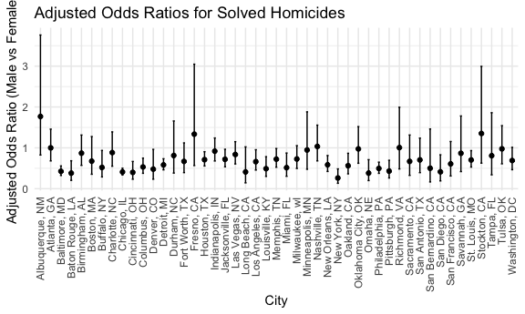
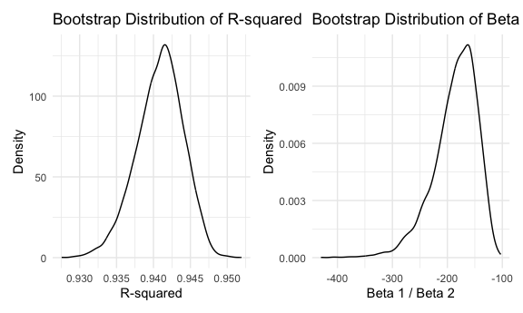
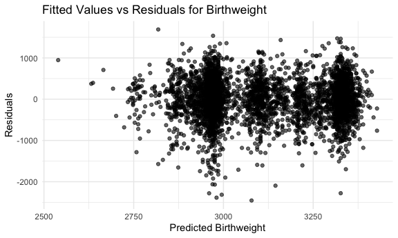
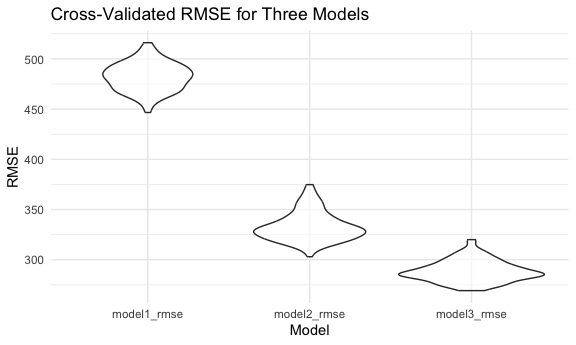

Homework 6
================
Mukta Patwari
2025-11-11

## Problem 1

Loading the homicide data

``` r
homicide_data =
  read_csv("homicide-data.csv") %>% 
  janitor::clean_names() %>% 
  mutate(
    city_state = str_c(city, state, sep = ", "),
    solved = factor(
  case_when(
    disposition %in% c("Closed without arrest", "Open/No arrest") ~ "Unsolved",
    TRUE ~ "Resolved"),
  levels = c("Unsolved", "Resolved"))
  ) %>% 
  filter(
    !city_state %in% c("Dallas, TX", "Phoenix, AZ", "Kansas City, MO", "Tulsa, AL"),
    victim_race %in% c("White", "Black")
  ) %>% 
  mutate(
    victim_age = as.numeric(victim_age)
  )
```

    ## Rows: 52179 Columns: 12
    ## ── Column specification ────────────────────────────────────────────────────────
    ## Delimiter: ","
    ## chr (9): uid, victim_last, victim_first, victim_race, victim_age, victim_sex...
    ## dbl (3): reported_date, lat, lon
    ## 
    ## ℹ Use `spec()` to retrieve the full column specification for this data.
    ## ℹ Specify the column types or set `show_col_types = FALSE` to quiet this message.

    ## Warning: There was 1 warning in `mutate()`.
    ## ℹ In argument: `victim_age = as.numeric(victim_age)`.
    ## Caused by warning:
    ## ! NAs introduced by coercion

Odds ratios for Baltimore

``` r
baltimore_df =
  homicide_data %>% 
  filter(city_state == "Baltimore, MD")

baltimore_fit =
  baltimore_df %>% 
  glm(
    formula = solved ~ victim_age + victim_sex + victim_race,
    data = .,
    family = binomial
  ) 

baltimore_fit %>% 
  broom::tidy(conf.int = TRUE) %>% 
  mutate(
    OR = exp(estimate), 
    OR_conf_low = exp(conf.low), 
    OR_conf_high = exp(conf.high)) %>%
  filter(term == "victim_sexMale") %>%
  select(term, OR, OR_conf_low, OR_conf_high) %>% 
  knitr::kable(digits = 3)
```

| term           |    OR | OR_conf_low | OR_conf_high |
|:---------------|------:|------------:|-------------:|
| victim_sexMale | 0.426 |       0.324 |        0.558 |

Odds ratios for all cities

``` r
cities_fit =
  homicide_data %>%
  group_by(city_state) %>%
  nest() %>%
  mutate(
    fit = map(data, ~ glm(
      solved ~ victim_age + victim_sex + victim_race,
      data = .x,
      family = binomial
    )),
    
    tidy = map(fit, ~ 
      broom::tidy(.x, conf.int = TRUE) %>%
        mutate(
          OR = exp(estimate),
          OR_conf_low = exp(conf.low),
          OR_conf_high = exp(conf.high)
        ) %>%
        filter(term == "victim_sexMale") %>%
        select(term, OR, OR_conf_low, OR_conf_high)
    )
  ) %>%
  unnest(tidy)
```

    ## Warning: There were 43 warnings in `mutate()`.
    ## The first warning was:
    ## ℹ In argument: `tidy = map(...)`.
    ## ℹ In group 1: `city_state = "Albuquerque, NM"`.
    ## Caused by warning:
    ## ! glm.fit: fitted probabilities numerically 0 or 1 occurred
    ## ℹ Run `dplyr::last_dplyr_warnings()` to see the 42 remaining warnings.

Plot

``` r
cities_fit %>%
  arrange(OR) %>%
  mutate(city_state = factor(city_state, levels = city_state)) %>%
  ggplot(aes(x = city_state, y = OR)) +
  geom_point() +
  geom_errorbar(aes(ymin = OR_conf_low, ymax = OR_conf_high), width = 0.2) +
  theme(axis.text.x = element_text(angle = 90, vjust = 0.5, hjust = 1)) +
  labs(
    title = "Adjusted Odds Ratios for Solved Homicides",
    x = "City",
    y = "Adjusted Odds Ratio (Male vs Female)"
  )
```



## Problem 2

``` r
library(p8105.datasets)
data("weather_df")
```

**Use 5000 bootstrap samples and, for each bootstrap sample, produce
estimates of these two quantities. Plot the distribution for your
estimates, and describe these in words.**

``` r
bootstrap_weather =
  weather_df %>%
  modelr::bootstrap(n = 5000) %>%
  mutate(
    model = map(strap, \(df) lm(tmax ~ tmin + prcp, data = df)),
    r_squared = map_dbl(model, ~ glance(.x)$r.squared),
    beta_ratio = map_dbl(model, ~ {
      coefs = tidy(.x)
      b1 = coefs$estimate[coefs$term == "tmin"]
      b2 = coefs$estimate[coefs$term == "prcp"]
      b1 / b2
    })
  )

r_squared_plot =
  bootstrap_weather %>%
  ggplot(aes(x = r_squared)) +
  geom_density(alpha = 0.5) +
  labs(
    title = "Bootstrap Distribution of R-squared", 
    x = "R-squared", 
    y = "Density")

beta_ratio_plot =
  bootstrap_weather %>% 
  ggplot(aes(x = beta_ratio)) +
  geom_density(alpha = 0.5) +
  labs(
    title = "Bootstrap Distribution of Beta 1 / Beta 2",
    x = "Beta 1 / Beta 2",
    y = "Density"
  )

r_squared_plot + beta_ratio_plot
```



This plot shows the bootstrap distributions for R-squared and the ratio
between Beta 1 and Beta 2 of the predictors. The left plot for R-squared
shows that the peak of the distribution is between 94% and 94.5%, and
this quantity means that 94-94.5% of the variation in max temperature is
explained by the regression model, and that the model has a relatively
strong goodness-of-fit. The right plot has the ratio for beta
coefficients, and provides insight into the relationship between tmin
and prcp as predictors. This plot shows a significant right skew, and
shows that the ratio is highly unstable.

**Using the 5000 bootstrap estimates, identify the 2.5% and 97.5%
quantiles to provide a 95% confidence interval.**

``` r
bootstrap_weather %>% 
  summarize(
    rsquared_lower = quantile(r_squared, 0.025),
    rsquared_upper = quantile(r_squared, 0.975),
    betaratio_lower = quantile(beta_ratio, 0.025),
    betaratio_upper = quantile(beta_ratio, 0.975)
  ) %>%
  pivot_longer(
    everything(),
    names_to = c("Estimates", "CI"),
    names_sep = "_"
  ) %>%
  pivot_wider(
    names_from = CI,
    values_from = value
  ) %>%
  mutate(
  Estimates = case_when(
    Estimates == "rsquared"  ~ "R-squared",
    Estimates == "betaratio" ~ "Beta ratio"
  )
) %>% 
  knitr::kable(digits = 3)
```

| Estimates  |    lower |    upper |
|:-----------|---------:|---------:|
| R-squared  |    0.934 |    0.947 |
| Beta ratio | -280.766 | -126.154 |

## Problem 3

**Load and clean the data for regression analysis (i.e. use appropriate
variable names, convert numeric to factor where appropriate, check for
the presence of missing data, etc.)**

``` r
birthweight_df =
  read_csv("birthweight.csv") %>% 
  janitor::clean_names() %>% 
  mutate(
    babysex = factor(
      case_match(
        babysex,
        1 ~ "male",
        2 ~ "female"
      ),
      levels = c("male", "female")
    ),
    frace = factor(
      case_match(
        frace,
        1 ~ "White",
        2 ~ "Black",
        3 ~ "Asian",
        4 ~ "Puerto Rican",
        8 ~ "Other",
        9 ~ "Unknown"
      ),
      levels = c("White", "Black", "Asian", "Puerto Rican", "Other", "Unknown")
    ),
    malform = factor(
      case_match(
        malform,
        0 ~ "absent",
        1 ~ "present"
      ),
      levels = c("absent", "present")
    ),
    mrace = factor(
      case_match(
        mrace,
        1 ~ "White",
        2 ~ "Black",
        3 ~ "Asian",
        4 ~ "Puerto Rican",
        8 ~ "Other",
        9 ~ "Unknown"
      ),
      levels = c("White", "Black", "Asian", "Puerto Rican", "Other", "Unknown")
    )
  )
```

    ## Rows: 4342 Columns: 20
    ## ── Column specification ────────────────────────────────────────────────────────
    ## Delimiter: ","
    ## dbl (20): babysex, bhead, blength, bwt, delwt, fincome, frace, gaweeks, malf...
    ## 
    ## ℹ Use `spec()` to retrieve the full column specification for this data.
    ## ℹ Specify the column types or set `show_col_types = FALSE` to quiet this message.

**Propose a regression model for birthweight. This model may be based on
a hypothesized structure for the factors that underly birthweight, on a
data-driven model-building process, or a combination of the two.
Describe your modeling process and show a plot of model residuals
against fitted values – use add_predictions and add_residuals in making
this plot**

Based on preexisting literature, some factors commonly associated with
low birthweight are [smoking during
pregnancy](https://link.springer.com/article/10.1186/s12884-024-06487-y),
[maternal age at
pregnancy](https://academic.oup.com/aje/article/186/11/1219/3858068),
and [mother’s
race](https://www.sciencedirect.com/science/article/abs/pii/S0091743518303311?via%3Dihub).
Therefore, the proposed model is that factors such as smoking, maternal
age, and maternal race affect birthweight. The following plot below
shows this regression model.

``` r
model_bwt = lm(bwt ~ smoken + momage + mrace, data = birthweight_df)

birthweight_df %>% 
  add_predictions(model_bwt) %>% 
  add_residuals(model_bwt) %>% 
  ggplot(aes(x = pred, y = resid)) +
  geom_point(alpha = 0.6) +
  labs(
    x = "Predicted Birthweight",
    y = "Residuals",
    title = "Fitted Values vs Residuals for Birthweight"
  )
```



**Compare your model to two others: 1) One using length at birth and
gestational age as predictors (main effects only), 2) One using head
circumference, length, sex, and all interactions (including the
three-way interaction) between these. Make this comparison in terms of
the cross-validated prediction error; use `crossv_mc` and functions in
`purrr` as appropriate.**

``` r
cv_df =
  crossv_mc(birthweight_df, n = 100)

cv_results = 
  cv_df %>%
  mutate(
    model1 = map(train, ~ lm(bwt ~ smoken + momage + mrace, data = .x)),
    model2 = map(train, ~ lm(bwt ~ blength + gaweeks, data = .x)),
    model3 = map(train, ~ lm(bwt ~ bhead * blength * babysex, data = .x)),
    model1_rmse = map2_dbl(model1, test, ~ rmse(.x, .y)),
    model2_rmse = map2_dbl(model2, test, ~ rmse(.x, .y)),
    model3_rmse = map2_dbl(model3, test, ~ rmse(.x, .y))
  ) %>% 
  select(model1_rmse, model2_rmse, model3_rmse) %>%
  pivot_longer(
    everything(),
    names_to = "model",
    values_to = "rmse"
  ) %>%
  mutate(
    model = fct_inorder(model)) %>% 
  ggplot(aes(x = model, y = rmse)) +
  geom_violin(alpha = 0.6) +
  labs(
    title = "Cross-Validating RMSE across Three Models",
    x = "Model",
    y = "RMSE"
  )

cv_results
```



Based on these violin plots, my proposed model has a very high RMSE,
meaning that there are much larger prediction errors and that it is not
a good model for birthweight. Comparatively, the other two models have
lower RMSEs, indicating that they are probably better models for
birthweight.
